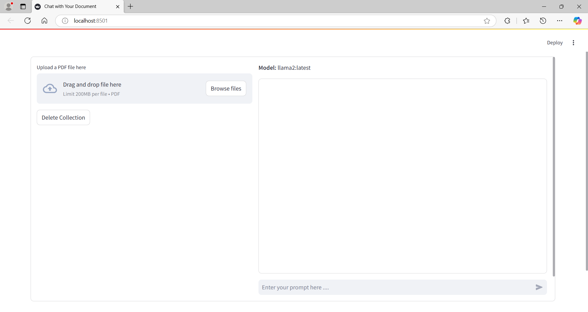

# Chat with Your Document using Ollama2, LangChain and Streamlit.

## Overview

This repository provides a **Streamlit** application that allows users to upload PDF documents, extract data, and interact with the content via a chatbot interface using **LangChain** and **Ollama** model.

**Note:**

- ***CPU:*** The application requires a system with at least 8 GB of RAM to run smoothly, as the Ollama2 model file is approximately 3.8 GB. The response time for each query may vary based on your system's performance.
- ***GPU:*** The application requires a system with at least 4 GB of RAM to run smoothly.GPU acceleration significantly reduces processing and response times for large files or complex queries.
  
The application supports both CPU and GPU execution modes, providing flexibility for various hardware setups.

## Features

- Upload a PDF document for processing.
- Extract data and create a vector database using `LangChain` and `Chroma`.
- View the pages of the uploaded PDF as images.
- Interact with the document content through a chat interface powered by **Ollama** model.
- Option to delete the vector database and reset the session.
- (optional) GPU utilization monitoring for better performance insights.

## Prerequisites

Before running the project, make sure you have the following installed:

### General Requirements
 
- **Python 3.8.20** (strictly required for compatibility)
- pip (Python package installer)
- [Ollama](https://ollama.com/download) (Download and install the Ollama model)

### GPU-Specific Requirements

- [NVIDIA GPU with CUDA support](https://developer.nvidia.com/cuda-gpus).
- [CUDA Toolkit](https://developer.nvidia.com/cuda-downloads) and [cuDNN](https://developer.nvidia.com/cudnn) installed on your system.
- **NVIDIA-SMI** installed for [GPU Utilization Monitoring](#GPU-Utilization-Monitoring).

### Setup Steps

1. You can get the source code in two ways:

- **Download as a ZIP file:** [Download here](https://github.com/AugustinRajkumar16/Chat-with-your-Document/archive/refs/heads/main.zip), then extract it to a folder of your choice.
- **Clone the repository using Git:** 

    ```bash
    git clone https://github.com/AugustinRajkumar16/Chat-with-your-Document.git
    ```

2. Create a virtual environment using Python 3.8.20 (this step is mandatory to avoid version conflicts):
   ```bash
   python3.8 -m venv env
   source env/bin/activate   # For Linux/Mac
   env\Scripts\activate      # For Windows
   ```

3. Install the required dependencies:
   ```bash
   pip install -r requirements.txt
   ```
4. Ensure **Ollama** is properly set up on your machine and that you have access to the desired models.

5. (optional) If using GPU acceleration, install PyTorch with CUDA support:
   ```bash
   pip install torch torchvision torchaudio --index-url https://download.pytorch.org/whl/cu118
   ```

## How to Run

1. **For CPU-only Execution:** To run the application on a CPU,

   ```bash
   streamlit run chat_with_your_document.py
   ```

2. **For GPU-Execution:** To run the application with GPU acceleration,

   ```bash
   streamlit run gpu_chat_with_your_document.py
   ```

   ### **GPU-Utilization-Monitoring**

   - Integrated GPU monitoring uses NVIDIA-SMI and py3nvml to track:
     1. GPU memory usage
     2. GPU processing load

   - GPU monitoring functions are integrated into the ***gpu_chat_with_your_document.py*** file at key processing steps:

     1. ***Initialization:*** Verifies GPU availability.
     2. ***PDF Processing:*** Tracks memory usage while creating vector databases.
     3. ***Chat Processing:*** Monitors GPU load during query execution.

3. The application will launch in your default web browser, or the terminal will provide a localhost URL that you can use to access the app interface.
   
   <p style="text-align: center;">
   
   </p>

## Usage Instructions

### Uploading a PDF

1. In the left column, use the **Upload a PDF file here** uploader to select a PDF document.
2. Once uploaded:
   - A progress bar will indicate the processing.
   - The app will create a vector database from the PDF content.
   - Extracted pages of the PDF will be displayed as images.

### Chat Interface

1. In the right column, interact with the chatbot by entering your queries in the text box.
2. The chatbot will process your query and provide a response based on the uploaded document content.

### Resetting/Deleting Data

- Click **Delete Collection** to remove the vector database and reset the session.

### Exit Commands

To exit the chatbot, you can type any of the following commands:

- close
- exit

## Notes

- **Performance:** Using a GPU will significantly reduce the processing and response time for large PDF files and complex queries.
- **Fallback:** If a GPU is not available, the application gracefully defaults to CPU execution.

### Supported Models

- The app automatically detects and uses available models from the **Ollama** API.
- The default model is pre-selected during runtime.

### Logging and Debugging

- Logs are stored in `log.txt` to assist with debugging.
- The log includes information about uploaded files, processing steps, and any errors encountered.

### Future Enhancements

- Add support for multiple PDF uploads.
- Improve error handling for unsupported file formats or invalid input.
- Extend compatibility with other language models and APIs.

## Acknowledgements

- [Ollama](https://ollama.com/)
- [LangChain](https://www.langchain.com/)
- [Streamlit](https://streamlit.io/)

## Contributions

Contributions are welcome! Feel free to open issues, suggest improvements, or submit pull requests.
